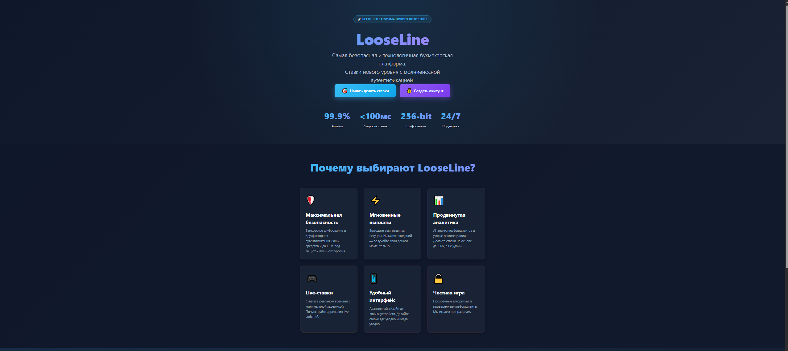
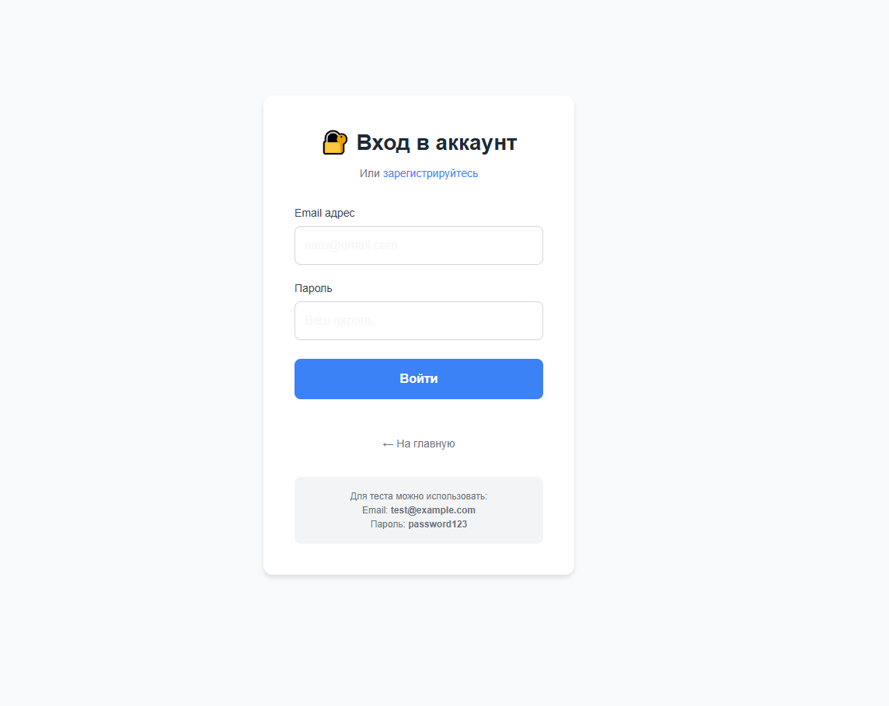
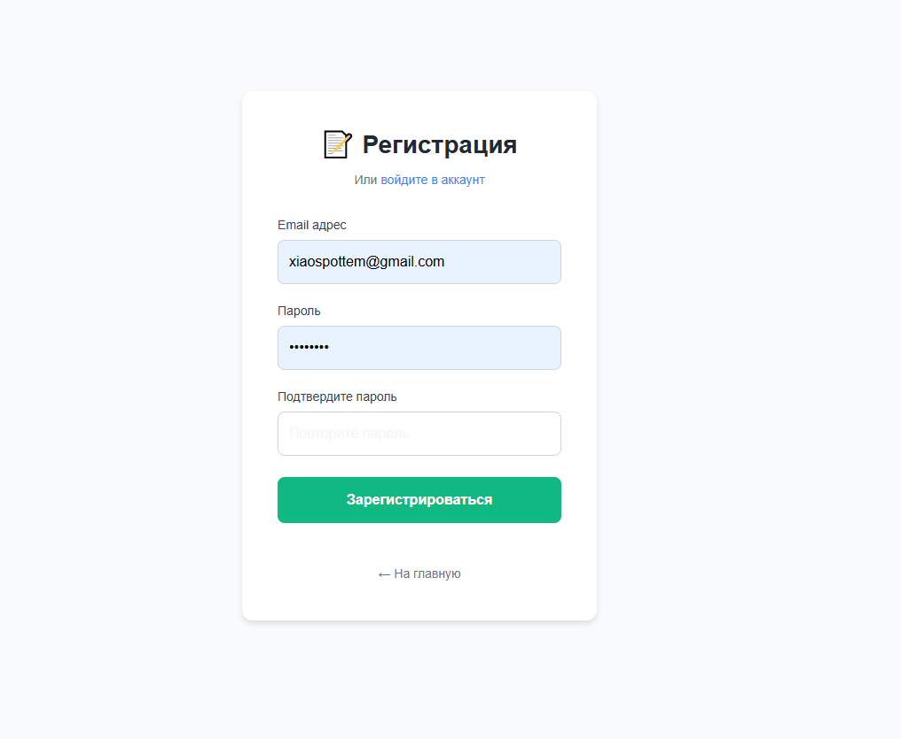
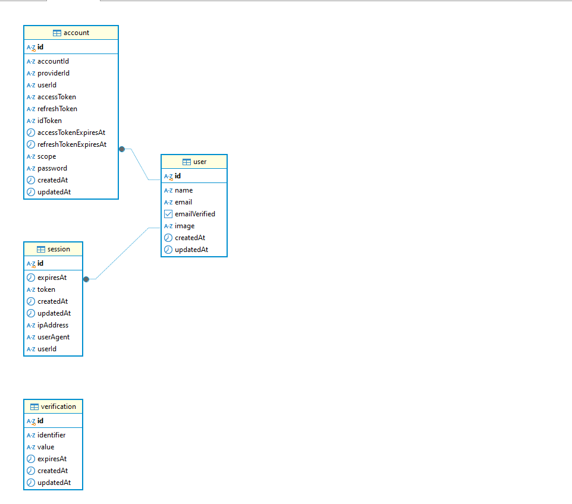
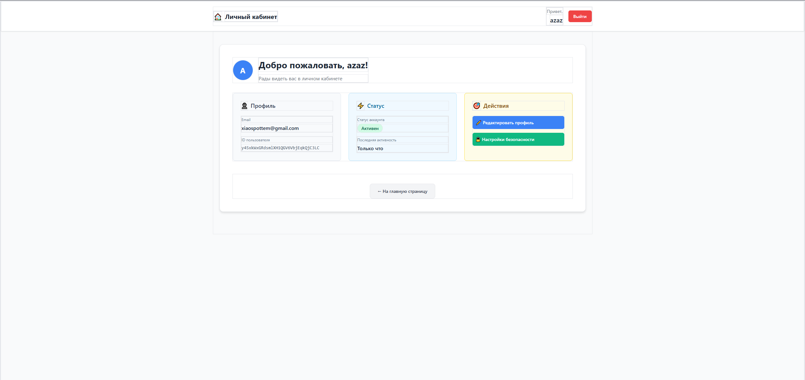
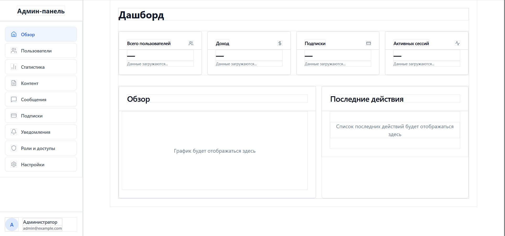

#### **Что сделано**

**1\. Метод 1: betterAuth(config)**

-  Инициализация системы аутентификации BetterAuth

-  Подключение к PostgreSQL через Pool

-  Конфигурация основных настроек авторизации

**2\. Метод 2: toNodeHandler(auth)**

-  Создание универсального API-обработчика

-  Поддержка GET и POST запросов

-  Маршрутизация всех эндпоинтов аутентификации

**3\. Метод 3: handleSubmit(e) \[Login\]**

-  Авторизация пользователя через email и пароль

-  Отправка POST-запроса на /api/auth/signin/email

-  Редирект на главную страницу при успехе

**4\. Метод 4: handleSubmit(e) \[Register\]**

-  Регистрация нового пользователя

-  Валидация совпадения паролей

-  Автоматический редирект на страницу входа

**5\. Метод 5: handleLogout()**

-  Выход из аккаунта пользователя

-  Очистка сессии через POST /api/auth/signout

-  Редирект на главную страницу

**6\. Метод 6: useEffect \[Session\]**

-  Получение данных текущей сессии

-  Загрузка информации о пользователе

-  Управление состоянием загрузки

**Скрин 1 -- Главная страница**

{width=2555px height=1142px}

**Скрин 2 -- Форма входа в аккаунт**

{width=1144px height=909px}

**Скрин 3 -- Форма регистрации**

{width=1016px height=835px}

**Скрин 4 -- Диаграмма БД**


{width=962px height=848px}

**Скрин 5 -- Личный кабинет пользователя**


{width=2545px height=1202px}

**Скрин 6 -- Дашборд админа**


{width=1925px height=900px}


[2025-12-18 02-14-44.mkv](<./2025-12-18 02-14-44.mkv>)

Видео с валидацией на проверку почты

[2025-12-18 02-16-02.mkv](<./2025-12-18 02-16-02.mkv>)

Видео с остальными валидациями и проверками

## Тестирование

Статус тестирования:

-  Юнит-тесты -- требуется добавить

-  Интеграционные тесты -- требуется добавить

# Таблица методов модуля аутентификации

| № | Название метода                | Назначение                                                                                                                                                                                    | Статус                |
|---|--------------------------------|-----------------------------------------------------------------------------------------------------------------------------------------------------------------------------------------------|-----------------------|
| 1 | `betterAuth(config)`           | Инициализирует систему аутентификации BetterAuth. Подключается к PostgreSQL через `Pool` с использованием `DATABASE_URL`. Конфигурирует все настройки авторизации.                            | Реализован (backend)  |
| 2 | `toNodeHandler(auth)`          | Создаёт универсальный обработчик для всех эндпоинтов аутентификации (`/signin`, `/signup`, `/signout`, `/session`). Экспортируется как GET и POST handler.                                    | Реализован (backend)  |
| 3 | `handleSubmit(e)` \[Login\]    | Авторизует пользователя. Отправляет `email` и `password` на `POST /api/auth/signin/email`. При успехе выполняет `router.push('/')` и `router.refresh()`.                                      | Реализован (frontend) |
| 4 | `handleSubmit(e)` \[Register\] | Регистрирует нового пользователя. Проверяет совпадение паролей, отправляет данные на `POST /api/auth/signup/email`. При успехе показывает сообщение и редиректит на `/login` через 2 секунды. | Реализован (frontend) |
| 5 | `handleLogout()`               | Выполняет выход из аккаунта. Отправляет `POST /api/auth/signout`, затем редиректит на главную страницу через `window.location.href = '/'`.                                                    | Реализован (frontend) |
| 6 | `useEffect` \[Session\]        | Загружает данные сессии при монтировании компонента Dashboard. Выполняет `GET /api/auth/session` и устанавливает `user` в состояние.                                                          | Реализован (frontend) |

---

## Детали реализации

### Метод 1: `betterAuth`

**Файл:** `auth.ts`\
**Использование:** Экспортируется как `auth` и используется в API route для обработки запросов аутентификации.\
**Пример:**

```typescript
import \{ betterAuth } from "better-auth" import \{ Pool } from "pg"

export const auth = betterAuth(\{ database: new Pool(\{ connectionString: process.env.DATABASE_URL }) })
```

### Метод 2: `toNodeHandler`

**Файл:** `app/api/auth/[...all]/route.ts`\
**Использование:** Создаёт обработчик, который маршрутизирует все запросы к BetterAuth.\
**Пример:**

```typescript
import \{ toNodeHandler } from "better-auth/node" import \{ auth } from "@/auth"

const handler = toNodeHandler(auth) export \{ handler as GET, handler as POST }
```

### Метод 3: `handleSubmit` \[Login\]

**Файл:** `app/login/page.tsx`\
**Использование:** Вызывается при отправке формы входа. Управляет состояниями loading и error.\
**Пример:**

```typescript
const handleSubmit = async (e: React.FormEvent) => \{ e.preventDefault() setLoading(true)

const response = await fetch('/api/auth/signin/email', \{ method: 'POST', headers: \{ 'Content-Type': 'application/json' }, body: JSON.stringify(\{ email, password }) })

if (response.ok) \{ router.push('/') router.refresh() } else \{ setError('Ошибка входа') } }
```

### Метод 4: `handleSubmit` \[Register\]

**Файл:** `app/register/page.tsx`\
**Использование:** Вызывается при отправке формы регистрации. Включает валидацию паролей.\
**Пример:**

```typescript
const handleSubmit = async (e: FormEvent) => \{ e.preventDefault()

if (password !== confirmPassword) \{ setError("Пароли не совпадают") return }

const response = await fetch('/api/auth/signup/email', \{ method: 'POST', headers: \{ 'Content-Type': 'application/json' }, body: JSON.stringify(\{ email, password, name: email.split('@')\[0\] }) })

if (response.ok) \{ setSuccess("Регистрация успешна!") setTimeout(() => router.push('/login'), 2000) } }
```

### Метод 5: `handleLogout`

**Файл:** `app/dashboard/page.tsx`\
**Использование:** Вызывается при клике на кнопку "Выйти" в личном кабинете.\
**Пример:**

```typescript
const handleLogout = async () => \{ try \{ await fetch('/api/auth/signout', \{ method: 'POST' }) window.location.href = '/' } catch (error) \{ console.error('Logout error:', error) } }
```

### Метод 6: `useEffect` \[Session\]

**Файл:** `app/dashboard/page.tsx`\
**Использование:** Выполняется при загрузке страницы Dashboard для получения данных пользователя.\
**Пример:**

```typescript
useEffect(() => \{ fetch('/api/auth/session') .then(res => res.json()) .then(data => \{ setUser(data.user || null) setLoading(false) }) .catch((error) => \{ console.error('Session fetch error:', error) setLoading(false) }) }, \[\])
```

---

## UI-компоненты

Вспомогательные компоненты главной страницы (`app/page.tsx`):

-  `InteractiveLink({ href, gradient, shadowColor, emoji, text })` -- интерактивные CTA-кнопки с hover-эффектами и анимацией

-  `StatItem({ number, label })` -- отображение статистики платформы (аптайм, скорость, шифрование)

-  `FeatureCard({ emoji, title, description, color })` -- карточки преимуществ с hover-анимацией

-  `StatusItem({ emoji, title, status, description, color })` -- статусы системы аутентификации