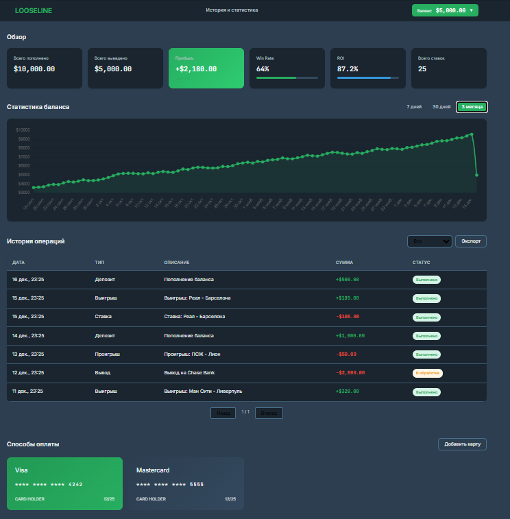
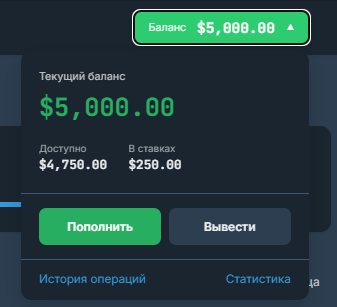

<https://github.com/Xizzz11/www>

**Что реализовано**

-  **Управление балансом:** Получение текущего баланса, доступных средств, заблокированных средств и статистики (ROI, win rate, net profit)

-  **Пополнение баланса:** Интеграция с Stripe для обработки платежей через новые и сохранённые карты, поддержка 3D Secure

-  **Вывод средств:** Создание запросов на вывод с валидацией лимитов (минимум \$10, максимум \$100,000, дневной лимит \$50,000)

-  **История операций:** Получение истории ставок и транзакций с фильтрацией по статусу, результату, дате и типу операции, поддержка пагинации

-  **Экспорт отчётов:** Генерация отчётов в форматах CSV и PDF с настраиваемыми параметрами (даты, включение ставок, транзакций, статистики)

-  **Управление способами оплаты:** Добавление, просмотр и удаление сохранённых карт через Stripe Payment Methods API

-  **Управление способами вывода:** Добавление, просмотр и удаление банковских счетов и других способов вывода с верификацией

-  **Webhook обработка:** Асинхронная обработка событий от Stripe (payment_intent.succeeded, payment_failed, requires_action, processing, canceled) с проверкой подписи

-  **Веб-интерфейс:** Полнофункциональный одностраничный интерфейс с графиками, таблицами истории и модальными окнами для операций

-  **Безопасность:** Логирование всех операций в audit_log, валидация входных данных через Pydantic схемы, проверка подписи Stripe webhook

<note type="lab">

Методы

</note>

## Wallet API (/api/wallet)

| Метод  | Endpoint                          | Описание                                         | Статус | Параметры                                                                                                  | Ответ                           |
|--------|-----------------------------------|--------------------------------------------------|--------|------------------------------------------------------------------------------------------------------------|---------------------------------|
| GET    | `/balance`                        | Получение баланса и статистики                   | ✅      | `X-User-ID` (header)                                                                                       | `BalanceResponse`               |
| POST   | `/deposit`                        | Пополнение баланса (новая или сохранённая карта) | ✅      | `amount`, `stripe_payment_method_id?`, `save_method?`                                                      | `DepositResponse`               |
| POST   | `/withdraw`                       | Вывод средств                                    | ✅      | `amount`, `withdrawal_method_id`, `reason?`                                                                | `WithdrawResponse`              |
| GET    | `/history`                        | История операций и ставок                        | ✅      | `limit`, `offset`, `status?`, `result?`, `date_from?`, `date_to?`, `transaction_type?`                     | `HistoryResponse`               |
| POST   | `/export`                         | Экспорт отчёта (CSV/PDF)                         | ✅      | `format`, `date_from?`, `date_to?`, `include_bets?`, `include_transactions?`, `include_statistics?`        | `ExportResponse`                |
| GET    | `/export`                         | Экспорт отчёта (GET версия)                      | ✅      | Query: `format`, `date_from?`, `date_to?`, `include_bets?`, `include_transactions?`, `include_statistics?` | `ExportResponse`                |
| GET    | `/payment-methods`                | Список сохранённых способов оплаты               | ✅      | `X-User-ID` (header)                                                                                       | `PaymentMethodsListResponse`    |
| POST   | `/payment-methods`                | Добавить способ оплаты                           | ✅      | `stripe_payment_method_id`, `set_as_default?`                                                              | `PaymentMethodResponse`         |
| DELETE | `/payment-methods/{method_id}`    | Удалить способ оплаты                            | ✅      | `method_id` (path)                                                                                         | `{"success": true}`             |
| GET    | `/withdrawal-methods`             | Список способов вывода                           | ✅      | `X-User-ID` (header)                                                                                       | `WithdrawalMethodsListResponse` |
| POST   | `/withdrawal-methods`             | Добавить способ вывода                           | ✅      | `withdrawal_type`, `bank_account_number?`, `bank_name?`, `iban?`, `crypto_wallet_address?`, `is_default?`  | `WithdrawalMethodInfo`          |
| DELETE | `/withdrawal-methods/{method_id}` | Удалить способ вывода                            | ✅      | `method_id` (path)                                                                                         | `{"success": true}`             |

## Webhook API (/api/webhook)

| Метод | Endpoint  | Описание                                         | Статус | Параметры                               | Ответ                   |
|-------|-----------|--------------------------------------------------|--------|-----------------------------------------|-------------------------|
| POST  | `/stripe` | Webhook от Stripe для обработки событий платежей | ✅      | `Stripe-Signature` (header), body (raw) | `{"status": "success"}` |

## Обрабатываемые события Stripe:

| Событие                          | Описание              | Статус |
|----------------------------------|-----------------------|--------|
| `payment_intent.succeeded`       | Платёж успешен        | ✅      |
| `payment_intent.payment_failed`  | Платёж ошибка         | ✅      |
| `payment_intent.requires_action` | Требует 3D Secure     | ✅      |
| `payment_intent.processing`      | Платёж обрабатывается | ✅      |
| `payment_intent.canceled`        | Платёж отменён        | ✅      |

## Web UI

| Метод | Endpoint                | Описание                                  | Статус |
|-------|-------------------------|-------------------------------------------|--------|
| GET   | `/`                     | Главная страница - веб-интерфейс кошелька | ✅      |
| GET   | `/static/css/style.css` | CSS стили                                 | ✅      |
| GET   | `/static/js/app.js`     | JavaScript приложение                     | ✅      |

## Health Check

| Метод | Endpoint  | Описание                   | Статус |
|-------|-----------|----------------------------|--------|
| GET   | `/health` | Проверка состояния сервиса | ✅      |

## Статистика

| Категория        | Реализовано | Всего | Процент |
|------------------|-------------|-------|---------|
| Wallet Endpoints | 11          | 11    | 100%    |
| Webhook Handlers | 5           | 5     | 100%    |
| Web UI           | 1           | 1     | 100%    |
| Health Check     | 1           | 1     | 100%    |
| ИТОГО            | 18          | 18    | 100%    |

## **Интерфейс**

{width=744px height=757px}

{width=337px height=307px}

## РЕЗУЛЬТАТЫ ТЕСТИРОВАНИЯ

<note type="info">

[LOOSELINE - Test .pdf](<./LOOSELINE - Test .pdf>)

</note>