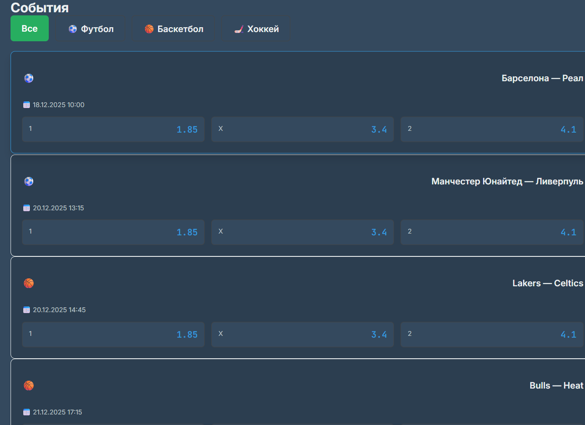
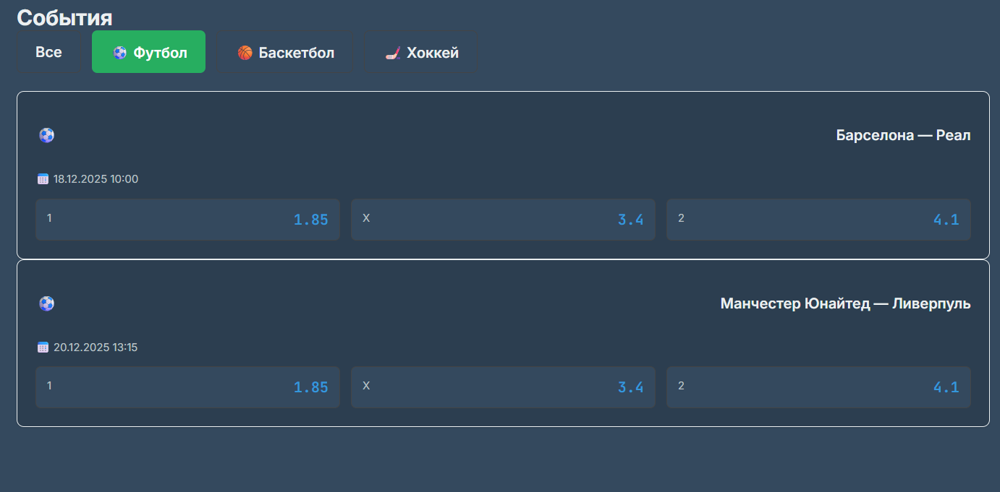
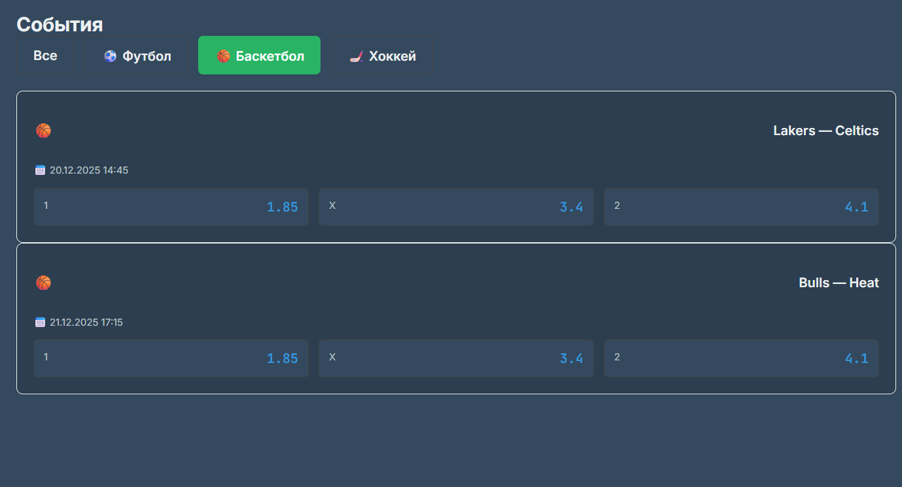
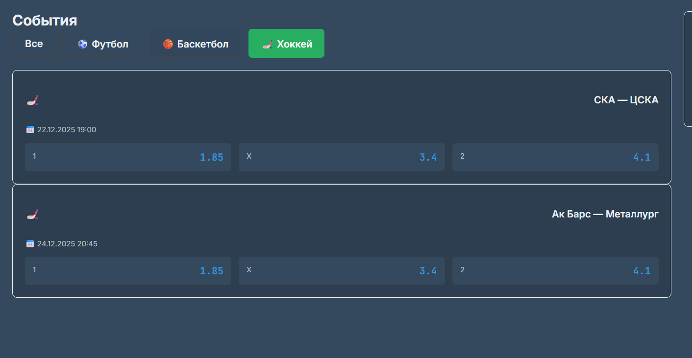
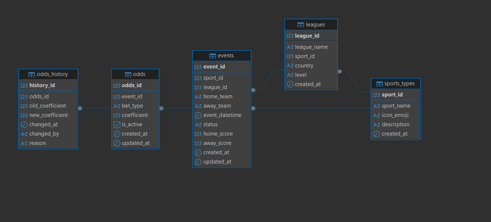
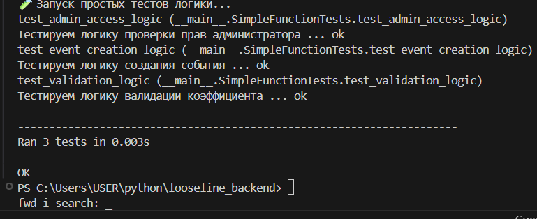

<https://github.com/belyyf/looseline>

## **Что сделано**

**1\. Метод 1: loadSportEvents(sport)**

-  Загружает список спортивных событий по выбранному виду спорта

-  Возвращает массив событий с полями: id, sport, title

-  Используется для отображения событий на главной странице

-  Поддерживает фильтрацию по типу спорта (football, basketball, hockey)

-  Обрабатывает ситуацию отсутствия данных (возвращает пустой массив)

**2\. Метод 2: getEventCoefficients(eventId)**

-  Получает коэффициенты для конкретного события

-  Возвращает коэффициенты исходов (П1, Х, П2)

-  Используется для отображения коэффициентов под каждым событием

-  Валидация: проверяет корректность eventId

-  Корректно работает при отсутствии коэффициентов (не вызывает ошибку)

**3\. Метод 3: calculatePotentialWin(amount, coefficient)**

-  Выполняет расчёт потенциального выигрыша по ставке

-  Формула расчёта:\
   **potentialWin = amount × coefficient**

-  Дополнительно рассчитывает прибыль:\
   **profit = potentialWin − amount**

-  Валидация:

   -  сумма ставки должна быть положительным числом

   -  коэффициент должен быть ≥ 1.01

-  Возвращает объект: amount, coefficient, potentialWin, profit

скрин 1- все события

{width=1332px height=968px}

скрин 2 - вкладка футбол

{width=1382px height=681px}

скрин 3 - вкладка баскетбол

{width=1379px height=746px}

скрин 4 - вкладка хоккей

{width=1412px height=731px}

скрин 5 - диаграмма бд

{width=1318px height=596px}

скрин 6 - запуск тестов

{width=769px height=314px}

## **Что проверяет каждый тест:**

### **TestLoadSportEvents**

-  Возврат данных для конкретного вида спорта

-  Возврат пустого списка при отсутствии типа

### **TestUpdateCoefficient**

-  Успешное обновление с причиной

-  Валидация недопустимых значений коэффициента

### **TestCreateEvent**

-  Успешное создание события с коэффициентами

-  Проверка прав администратора


<table header="row">
<colgroup><col width="195"/><col width="195"/><col width="313"/><col width="195"/></colgroup>
<tr>
<td>

№

</td>
<td>

Название метода

</td>
<td>

Назначение

</td>
<td>

Статус

</td>
</tr>
<tr>
<td>

1

</td>
<td>

**loadSportEvents(sport)**

</td>
<td>

Загружает список спортивных событий по выбранному виду спорта. Возвращает массив событий с полями `id`, `sport`, `title`. Используется для отображения событий на главной странице.

</td>
<td>

Реализован (backend)

</td>
</tr>
<tr>
<td>

2

</td>
<td>

getEventCoefficients(eventId)

</td>
<td>

Получает коэффициенты исходов (П1, Х, П2) для конкретного события. Используется для отображения коэффициентов под карточкой события.

</td>
<td>

Реализован (backend)

</td>
</tr>
<tr>
<td>

3

</td>
<td>

calculatePotentialWin(amount, coefficient

</td>
<td>

Выполняет расчёт потенциального выигрыша по выбранной ставке. Возвращает потенциальную выплату и чистую прибыль.

</td>
<td>

Реализован (backend)

</td>
</tr>
<tr>
<td>

4

</td>
<td>

fetchEvents()

</td>
<td>

Выполняет HTTP-запрос к API `/api/events`. Получает список событий и сохраняет их в состоянии приложения.

</td>
<td>

Реализован (frontend)

</td>
</tr>
<tr>
<td>

5

</td>
<td>

selectOutcome(eventId, outcome, coefficient)

</td>
<td>

Обрабатывает выбор исхода пользователем (П1 / Х / П2). Сохраняет выбранный коэффициент для дальнейшего расчёта.

</td>
<td>

Реализован (frontend)

</td>
</tr>
<tr>
<td>

6

</td>
<td>

updateBetAmount(value)

</td>
<td>

Обновляет сумму ставки при вводе пользователем. Используется для динамического перерасчёта потенциального выигрыша.

</td>
<td>

Реализован (frontend)

</td>
</tr>
<tr>
<td>

7

</td>
<td>

renderEventCard(event)

</td>
<td>

Отображает карточку события с названием, датой и коэффициентами. Используется для визуального представления событий.

</td>
<td>

Реализован (frontend)

</td>
</tr>
</table>


## етали реализации

### Метод 1: loadSportEvents

**Файл:**\
`src/events/services/eventService.js`

**Использование:**\
Вызывается при инициализации главной страницы и при смене выбранного вида спорта.\
Используется для загрузки и отображения списка спортивных событий.

**Пример:**

```
const events = await loadSportEvents('football')
// events = [{ id, sport, title, startTime }]
```

---

### Метод 2: getEventCoefficients

**Файл:**\
`src/events/services/eventService.js`

**Использование:**\
Вызывается при открытии карточки события.\
Получает коэффициенты исходов для конкретного события.

**Пример:**

```
const coefficients = await getEventCoefficients('event123')
// coefficients = { HOME: 1.85, DRAW: 3.4, AWAY: 4.2 }
```

---

### Метод 3: calculatePotentialWin

**Файл:**\
`src/bets/services/betService.js`

**Использование:**\
Вызывается автоматически через `useMemo` в `BetSlipContext`\
при изменении суммы ставки или коэффициента.

**Пример:**

```
const { payout, profit } = calculatePotentialWin(100, 1.85)
// payout = 185.00
// profit = 85.00
```

### Метод 4: updateBetStatus

**Файл:**\
`src/bets/services/betService.js`

**Использование:**\
Вызывается при отмене ставки пользователем\
или при отмене события администратором.

**Пример:**

```
// Отмена ставки
const result = await updateBetStatus('bet123', 'cancelled', 'Передумал')
// result = {
//   success: true,
//   betId: 'bet123',
//   status: 'cancelled',
//   refundAmount: null,
//   transactionType: 'bet_cancelled'
// }
```