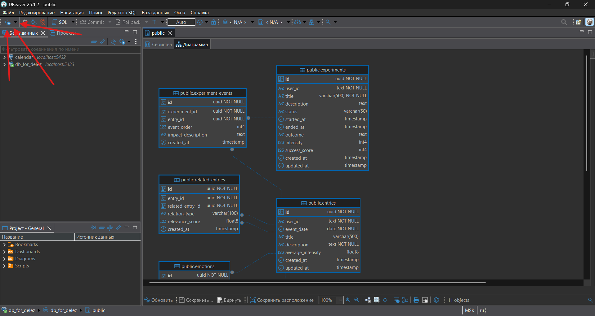

# Сначала запускаем нашу БД

1. Скачиваем Docker

2. Запускаем и каждый раз перед разработкой его запускаем, иначе будет выдавать ошибку при вводе следующей команды: **docker compose up -d**

3. **Вводим команду:** docker compose up -d

### После

1. Скачиваем DBeaver: https://dbeaver.io/

2. Жмём сюда:

   {width=1918px height=1021px}

3. Выбираем PostgreSQL

**Далее вводим нужные данные для подключения, их можно спросить у ИИ после того как она создала таблицы.**