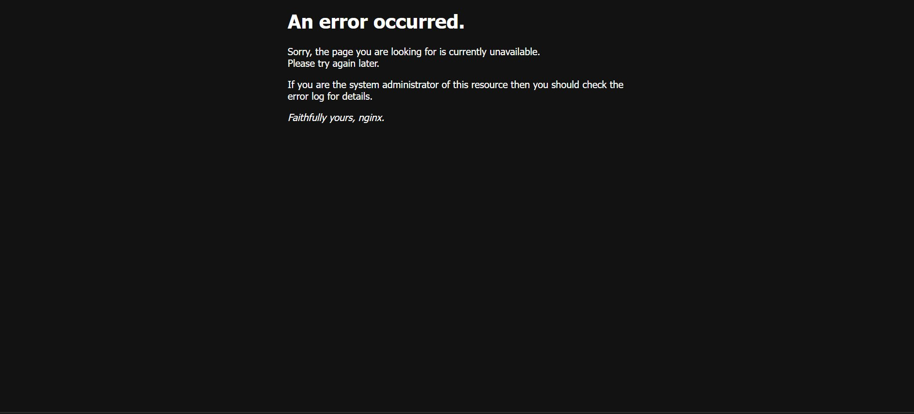

<note>

<http://localhost/admin> - админ панель

<http://localhost/wallet> - статистика

<http://localhost/sports/> - события

<http://localhost/dashboard> - профиль

<http://localhost/> - лендинг

<http://localhost/login> - вход

<http://localhost/register> - регистрация

<http://localhost/forgot-password> - восстановление пароля

</note>

**Чтобы увидеть свои изменения, нужно вводить следующие команды (в зависимости от измененного модуля):**

**Вот какие модули есть:**

-  **postgres** \- Основной сервер баз данных (PostgreSQL 15). В нем хранятся данные для всех модулей приложения (пользователи, ставки, транзакции, спортивные события).

-  **betting-backend** - Серверная часть для модуля ставок и расчетов. Созданный на Python (FastAPI), он управляет логикой размещения ставок, расчета коэффициентов и подведения итогов.

-  **betting-frontend** - интерфейс для модуля ставок. Созданный на основе React, он предоставляет пользовательский интерфейс для оформления купона и активных ставок.

-  **redis -** Быстрое хранилище в оперативной памяти, используемое для кэширования и управления сеансами. В частности, оно используется в финансовом отделе для эффективной обработки данных.

-  **finance-backend -** Серверная часть модуля "Финансы и история". Созданный на Python (FastAPI), он управляет кошельками пользователей, транзакциями ввода/вывода средств (интеграция с Stripe) и историей транзакций.

-  **finance-frontend -** интерфейс для раздела Финансы/кошелек. Он обслуживает статические файлы для интерфейса кошелька (интерфейс ввода/вывода средств).

-  **auth-app -** модуль аутентификации и управления пользователями. Созданный на основе Next.js и улучшенный-Auth, он обрабатывает регистрацию пользователей, вход в систему и управление профилями (панель мониторинга).

-  **sports-backend -** Серверная часть для модуля управления спортивными событиями. Созданный на Python (Flask), он управляет созданием и поиском спортивных матчей и событий.

-  **nginx -** Основной веб-сервер и средство балансировки нагрузки. Он действует как "диспетчер трафика", получая все запросы пользователей и перенаправляя их в нужный сервис (например, /api/auth -> auth-app, /sports -> sports-frontend).

-  **sports-frontend -** интерфейс для спортивного модуля. Созданный с помощью React, он отображает пользователю список спортивных событий, матчей и коэффициентов

**Такую команду вводить:**

-  docker compose build ИМЯ МОДУЛЯ

-  docker compose up -d ИМЯ МОДУЛЯ

**ЕСЛИ ИЗМЕНЕНИЯ КАСАЛИСЬ КОРНЯ ПРОЕКТА, НЕ КОНКРЕТНОГО МОДУЛЯ, ТО ВВОДИМ:**

-  docker compose build

-  docker compose up -d

**ДЛЯ КАЖДОЙ КОМАНДЫ (build) МОЖНО ДОБАВИТЬ ФЛАГ --no-cache. Например:**

-  docker compose build --no-cache

-  docker compose build ИМЯ МОДУЛЯ --no-cache

   **ВОЗОЗМОЖНЫЕ ТРАБЛЫ**

{width=1887px height=855px}

**Если видим такую страницу то вводим:**

docker restart looseline_nginx

-  **Немного может потребоваться подождать, если вообще не помогает, то вводим это:**

   docker logs looseline_nginx

   -  **Полученный вывод закидываем в нейронку**