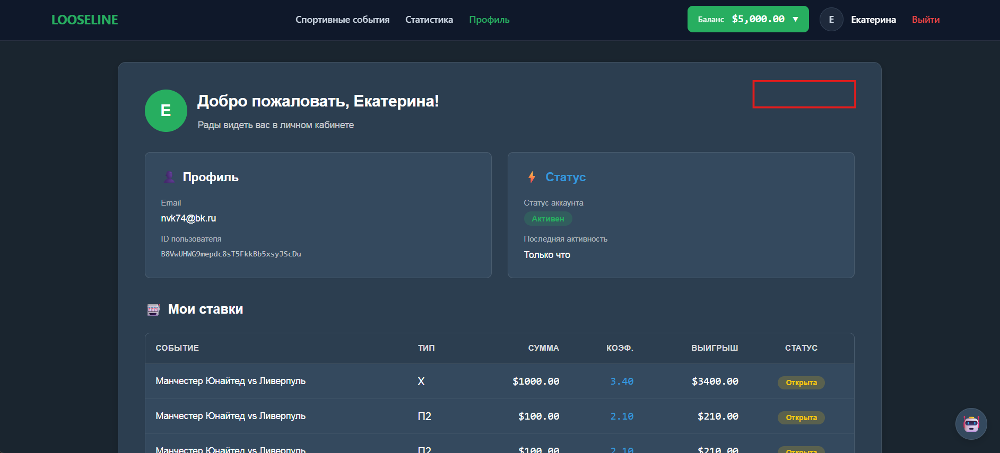
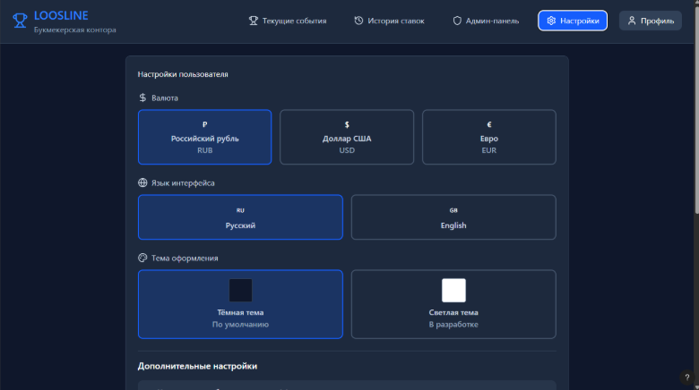
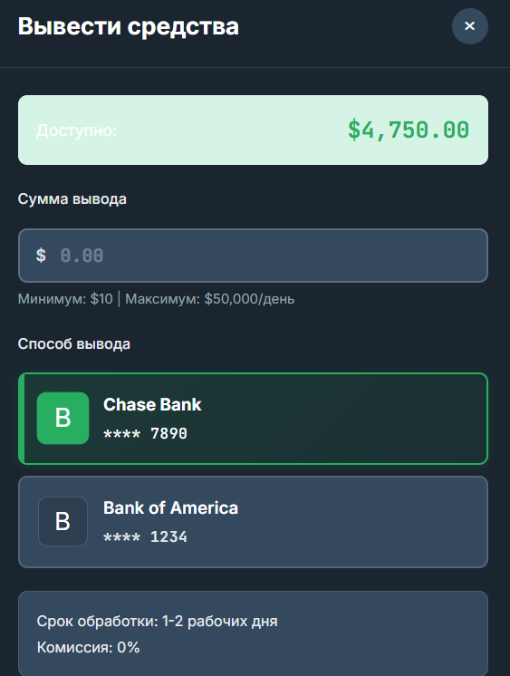

**РАБОТАЙ В СВОЕЙ ВЕТКЕ:** [**https://github.com/kruStrip/LooseLINE\_/tree/Gyzz_n**](https://github.com/kruStrip/LooseLINE_/tree/Gyzz_n)

<note type="tip">

* [ ] То есть создай новый проект в своем редакторе, склонируй реп

* [ ] ПОЛОЖИ В КОРЕНЬ ПРОЕКТА ФАЙЛ [.env](./.env.env)

* [ ] Потом введи **(перед этим запусти Docker и удали все контейнеры из него)**:

-  docker compose up -d

-  docker compose --profile migrations up (после этой команды подожди мин 5-10, там таблички создаются)

</note>

**ЗАДАЧИ ВЫПОЛНЯТЬ ПО ПОРЯДКУ**

**Твоя страница находится по адресу:**

* [ ] [ПЕРВЫМ ДЕЛОМ ПРОЧИТАТЬ](./adresa-stranic)

* [ ] Сделать чтобы работало ‘Пополнение‘ и ‘Вывод‘ средств

* [ ] Сделать чтобы работал экспорт в PDF и SCV)))))))))))))))))))))))))))))))))))))))))

* [ ] Сделать различные проверки вручную, по типу можно ли вывести больше средств чем есть на балансе. Если работа идет не так как нужно - **исправить**

* [ ] Добавить на эту страницу кнопку ‘Настройки‘ (сделать чтобы по нажатию открывалось наше модальное окно, с.м задачи ниже)

   {width=1885px height=855px}

* [ ] Добавить модальное окно настроек **(язык не делай, только валюту и тему)**:

* [ ] {width=780px height=436px}

* [ ] [Модальное окно должно соответствовать общему стилю](./../../DESIGN_SYSTEM/_index)

* [ ] Сделать чтобы настройки работали)

* [ ] Сделать чтобы слово ‘Доступно‘, было читаемо (перекрась в черный хз)

   {width=563px height=746px}