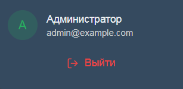

**РАБОТАЙ В СВОЕЙ ВЕТКЕ:** <https://github.com/kruStrip/LooseLINE\_/tree/Titov_n>

<note type="tip">

* [ ] То есть создай новый проект в своем редакторе, склонируй реп

* [ ] ПОЛОЖИ В КОРЕНЬ ПРОЕКТА ФАЙЛ [.env](./.env.env)

* [ ] Потом введи **(перед этим запусти Docker и удали все контейнеры из него)**:

-  docker compose up -d

-  docker compose --profile migrations up (после этой команды подожди мин 5-10, там таблички создаются)

</note>

**ЗАДАЧИ ВЫПОЛНЯТЬ ПО ПОРЯДКУ**

* [ ] [ПЕРВЫМ ДЕЛОМ ПРОЧИТАТЬ](./adresa-stranic)

* [ ] Сделать чтобы восстановление пароля (<http://localhost/forgot-password>) - **работало**

* [ ] Сделать чтобы для входа на страницу админа (<http://localhost/admin>) - нужно было войти в систему

* [ ] Сделать чтобы на странице админа можно было выдавать права

* [ ] Сделать чтобы по нажатию на кнопку ‘Выход‘ - пользователь действительно выходил и при попытке вернутся обратно, ему не давало пока он заново не пройдет вход в систему

* [ ] Также сделать чтобы было написано не admin@example, а реальные данные пользователя

   {width=307px height=149px}

* [ ] Сделать чтобы на страницу админа мог зайти только пользователь с правами админа

* [ ] Реализовать отображение реальных данных из бд, во всех элементах где это требуется, на страницах:

   -  <http://localhost/admin/users>

   -  <http://localhost/admin/roles>

* [ ] Реализовать бан пользователей

* [ ] Сделать чтобы пользователь имеющий бан не мог войти/зарегистрироваться в систему

* [ ] Сделать чтобы после регистрации нужно было подтвердить свой email на почте, и только после подтверждения ты можешь войти

* [ ] Также сделать при смене пароля, нужно чтобы приходило сообщение на почту в котором находится ссылка на смену пароля